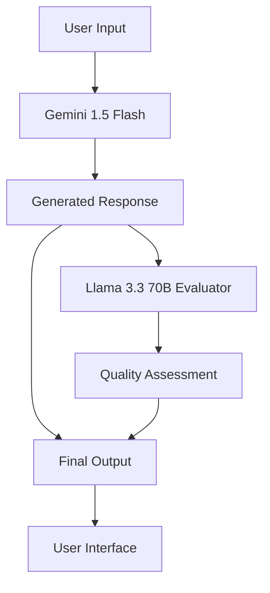

# 🤖 AI Chatbot with Cross-Model Evaluator

[](https://www.python.org/downloads/)
[](https://gradio.app/)
[](https://opensource.org/licenses/MIT)
[](https://huggingface.co/spaces)

An advanced AI chatbot system that combines **Google Gemini** for response generation with **Groq Llama 3.3 70B** for quality evaluation, providing transparent AI interactions with built-in response assessment.

## 🌟 Features

### ✨ **Dual-Model Architecture**
- **Primary Agent**: Google Gemini 1.5 Flash for fast, accurate responses
- **Evaluator**: Groq Llama 3.3 70B for objective response quality assessment
- **Cross-Model Validation**: Independent evaluation reduces bias and improves reliability

### 🚀 **Performance & Scalability**
- **API-Based**: No local model hosting required - lightning fast responses
- **Cloud Ready**: Optimized for Hugging Face Spaces deployment
- **Real-time Metrics**: Performance tracking and response time monitoring
- **Resource Efficient**: Minimal computational requirements

### 🎛️ **Advanced Controls**
- **Temperature Control**: Adjust creativity vs. accuracy balance
- **Token Limits**: Customize response length
- **Model Selection**: Choose from available Gemini variants
- **Evaluation Toggle**: Enable/disable response assessment

### 🔍 **Quality Assurance**
- **Automated Evaluation**: Every response gets quality scored (1-10)
- **Feedback System**: Detailed analysis with improvement suggestions  
- **Acceptance Rating**: Clear ACCEPTABLE/UNACCEPTABLE classifications
- **Bias Detection**: Cross-model perspective reduces single-model limitations

## 🏗️ Architecture Overview



### **Two-Stage Pipeline:**

1. **Generation Stage** (Gemini)
   - Processes user queries
   - Generates comprehensive responses
   - Optimized for helpfulness and accuracy

2. **Evaluation Stage** (Llama 70B)
   - Analyzes response quality
   - Checks for accuracy and completeness
   - Provides constructive feedback
   - Scores responses 1-10

## 🚀 Quick Start

### Prerequisites
- Python 3.8 or higher
- Google AI API key ([Get here](https://makersuite.google.com/app/apikey))
- Groq API key ([Get here](https://console.groq.com/keys))

### Local Installation

1. **Clone the repository**
```bash
git clone https://github.com/yourusername/ai-chatbot-evaluator.git
cd ai-chatbot-evaluator
```

2. **Install dependencies**
```bash
pip install -r requirements.txt
```

3. **Set up environment variables**
```bash
# Create .env file
echo "GOOGLE_API_KEY=your_google_api_key_here" > .env
echo "GROQ_API_KEY=your_groq_api_key_here" >> .env
```

4. **Run the application**
```bash
python app.py
```

5. **Open your browser**
Navigate to `http://localhost:7860`

## 🔑 API Key Setup

### Google AI API Key
1. Go to [Google AI Studio](https://makersuite.google.com/app/apikey)
2. Create a new API key
3. Copy and add to your `.env` file

### Groq API Key  
1. Visit [Groq Console](https://console.groq.com/keys)
2. Sign up/login and create an API key
3. Copy and add to your `.env` file

### Environment Variables
```bash
# Required for Gemini models
GOOGLE_API_KEY=your_google_api_key_here

# Required for Llama evaluation
GROQ_API_KEY=your_groq_api_key_here
```

## 🌐 Deployment

### Hugging Face Spaces (Recommended)

1. **Create a new Space**
   - Go to [Hugging Face Spaces](https://huggingface.co/spaces)
   - Choose "Gradio" as the SDK

2. **Upload files**
   - `app.py`
   - `requirements.txt`
   - `README.md`

3. **Set secrets**
   - Go to Settings → Repository secrets
   - Add `GOOGLE_API_KEY` and `GROQ_API_KEY`

4. **Deploy**
   - Push to main branch
   - Space will auto-deploy

### Docker Deployment
```dockerfile
FROM python:3.9-slim

WORKDIR /app
COPY requirements.txt .
RUN pip install -r requirements.txt

COPY app.py .
EXPOSE 7860

CMD ["python", "app.py"]
```

## 📖 Usage Guide

### Basic Interaction
1. **Enter your question** in the text box
2. **Choose models** (default: Gemini 1.5 Flash + Llama 3.3 70B)
3. **Adjust settings** (temperature, max tokens)
4. **Click "Generate & Evaluate"**
5. **Review both response and evaluation**

### Advanced Features

#### Temperature Control
- **0.1-0.3**: Focused, deterministic responses
- **0.4-0.7**: Balanced creativity and accuracy  
- **0.8-1.0**: Maximum creativity and variation

#### Evaluation Insights
- **Quality Score**: Numerical rating (1-10)
- **Strengths**: What the response did well
- **Issues**: Areas needing improvement
- **Suggestions**: Specific improvement recommendations

### Example Queries
- "Explain quantum computing in simple terms"
- "Write a Python function to sort a list"
- "What are the main causes of climate change?"
- "Compare machine learning vs deep learning"
- "How does blockchain technology work?"

## 🛠️ Technical Specifications

### Supported Models

#### **Agent Models (Response Generation)**
| Model | Description | Max Tokens | Use Case |
|-------|-------------|------------|----------|
| Gemini 1.5 Flash | Fast, efficient responses | 2048 | General purpose |

#### **Evaluator Models (Quality Assessment)**  
| Model | Description | Provider | Specialty |
|-------|-------------|----------|-----------|
| Llama 3.3 70B | Advanced reasoning | Groq | Critical evaluation |

### API Endpoints Used
- **Google Gemini API**: `https://generativelanguage.googleapis.com/v1beta/openai/`
- **Groq API**: `https://api.groq.com/openai/v1`

### Performance Metrics
- **Average Response Time**: 2-5 seconds (combined)
- **Concurrent Users**: Scales with API limits
- **Memory Usage**: <100MB (no local models)

## 🔧 Configuration

### Model Parameters
```python
AGENT_MODELS = {
    "Gemini 1.5 flash": {
        "model": "gemini-1.5-flash",
        "max_tokens": 2048,
        "description": "Fast Gemini model"
    }
}

EVALUATOR_MODELS = {
    "Llama 3.3 70B": {
        "model": "llama-3.3-70b-versatile", 
        "description": "Groq's Llama 3.3 70B"
    }
}
```

### Custom Evaluation Prompt
The evaluator uses a structured prompt to assess:
- Response accuracy and completeness
- Clarity and coherence  
- Potential biases or issues
- Improvement suggestions

## 🐛 Troubleshooting

### Common Issues

#### **API Key Errors**
```
❌ Invalid Google API key. Please check GOOGLE_API_KEY.
```
**Solution**: Verify your API key is correct and has necessary permissions

#### **Rate Limits**
```
❌ Rate limit exceeded. Please wait a moment and try again.
```
**Solution**: Wait for rate limit reset or upgrade API plan

#### **Model Availability**
```  
❌ Model 'gemini-1.5-pro' not available. Try another model.
```
**Solution**: Check model availability in your region or use alternative models

### Debug Mode
Enable detailed logging by setting:
```python
import logging
logging.basicConfig(level=logging.DEBUG)
```

## 🤝 Contributing

We welcome contributions! Here's how you can help:

### Development Setup
1. Fork the repository
2. Create a feature branch (`git checkout -b feature/amazing-feature`)
3. Make your changes
4. Add tests if applicable
5. Commit your changes (`git commit -m 'Add amazing feature'`)
6. Push to branch (`git push origin feature/amazing-feature`)
7. Open a Pull Request

### Areas for Contribution
- 🔧 **New Models**: Add support for additional AI models
- 🎨 **UI/UX**: Improve the Gradio interface  
- 📊 **Analytics**: Enhanced response metrics and visualization
- 🔍 **Evaluation**: Better evaluation criteria and prompts
- 🌐 **Internationalization**: Multi-language support
- 📚 **Documentation**: Tutorials and guides

### Code Standards
- Follow PEP 8 style guidelines
- Add docstrings to functions
- Include type hints where possible
- Write descriptive commit messages

## 📊 Roadmap

### Version 2.0 Features
- [ ] **Multi-Model Support**: Additional agent models (Claude, GPT-4)
- [ ] **Custom Evaluators**: User-defined evaluation criteria
- [ ] **Conversation History**: Persistent chat sessions
- [ ] **Response Comparison**: Side-by-side model comparisons
- [ ] **Advanced Analytics**: Response quality trends
- [ ] **Plugin System**: Extensible evaluation modules

### Long-term Goals
- [ ] **Fine-tuned Evaluators**: Custom evaluation models
- [ ] **Real-time Learning**: Adaptive response improvement
- [ ] **Enterprise Features**: Team collaboration tools
- [ ] **API Endpoints**: RESTful API for integration

## 📄 License

This project is licensed under the MIT License - see the [LICENSE](LICENSE) file for details.

## 🙏 Acknowledgments

- **Google AI** for Gemini API access
- **Groq** for fast Llama inference
- **Gradio Team** for the fantastic UI framework  
- **Hugging Face** for seamless deployment platform
- **Open Source Community** for inspiration and support

## 📞 Support & Contact

- **Issues**: [GitHub Issues](https://github.com/yourusername/ai-chatbot-evaluator/issues)
- **Discussions**: [GitHub Discussions](https://github.com/yourusername/ai-chatbot-evaluator/discussions)  
- **Email**: your.email@domain.com
- **Twitter**: [@yourusername](https://twitter.com/yourusername)

## ⭐ Star History

[](https://star-history.com/#yourusername/ai-chatbot-evaluator&Date)

---

<div align="center">

**Made with ❤️ and powered by AI**

[⬆ Back to Top](#-ai-chatbot-with-cross-model-evaluator)

</div>
